# 🐍 💻 Setting Up a Python Environment on Mac for Data Science
This tutorial will guide you on how to set up a Python environment on your Mac for data science! My goal is to teach you the following skills to get you started on your data science journey:

- Preparing your Mac
- Basic use of the command line
- Downloading Python
- Preparing and IDE and connecting it to Python
- Basic use of GitHub via the command line
- Using `.zshrc` files
- Bonus: Customizing your terminal and other useful settings

# 🚀 TL;DR
If you are already familiar with setting up Python on Mac or just want to jump straight in:
- Make sure terminal uses zsh (Mac default)
- [Install Oh My Zsh](https://ohmyz.sh/)
- [Install Brew](https://brew.sh/)
- [Install Miniconda](https://docs.conda.io/en/latest/miniconda.html)
- `conda install -c conda-forge jupyterlab`
- Download preferred IDE
- Connect your respective IDE interpreter to Miniconda Python

# 📚 Tutorial
## **Set Up Terminal**
1. Create a folder within your home folder called `repo`.

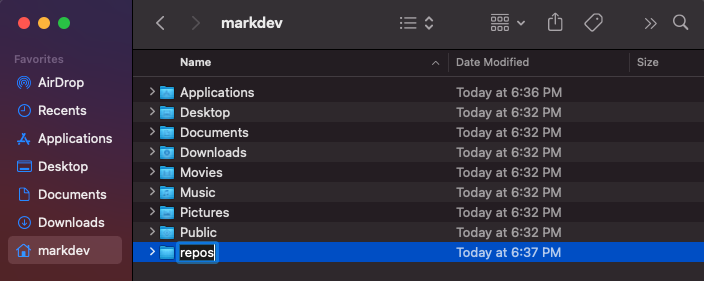

2. Ensure that your Mac is using zsh for your terminal (this should be the default since macOS 10.15).
   - [Download zsh](http://zsh.sourceforge.net/) if it not your default.

3. [Install iTerm2](https://iterm2.com/), which is a "terminal emulator" that will replace your terminal and add some great functionality.

4. [Install Xcode](https://developer.apple.com/xcode/), though not required for running Python some packages need it and it's a pain to download in the middle of your work.

5. [Install Oh My Zsh](https://ohmyz.sh/), which is an open source framework that allows you to manage and configure zsh through a `.zshrc` file (i.e. zsh on ✨steroids✨). Every time you open your terminal, your `.zshrc` will run to automatically set up your configurations.

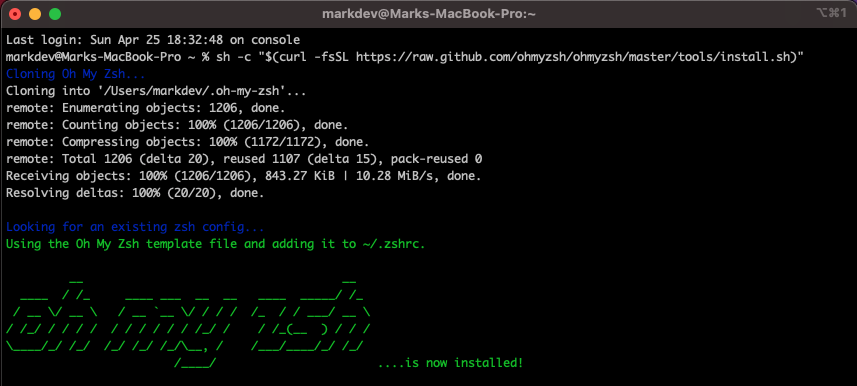

After installing Oh My Zsh, your user home directory should have the following hidden files:

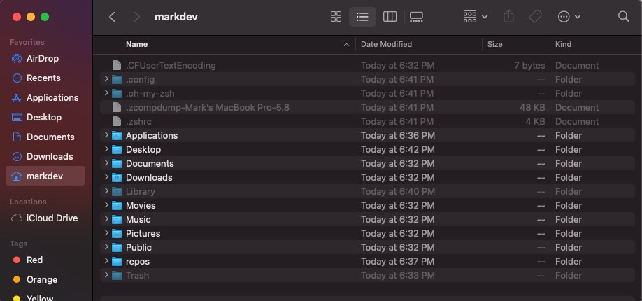

6. [Install Brew](https://brew.sh/), which allows you to download other packages outside of the Python ecosystem, by executing the following line of code in your terminal:
```
> /bin/bash -c "$(curl -fsSL https://raw.githubusercontent.com/Homebrew/install/HEAD/install.sh)"
```

This is what my terminal looked like after running the above command.

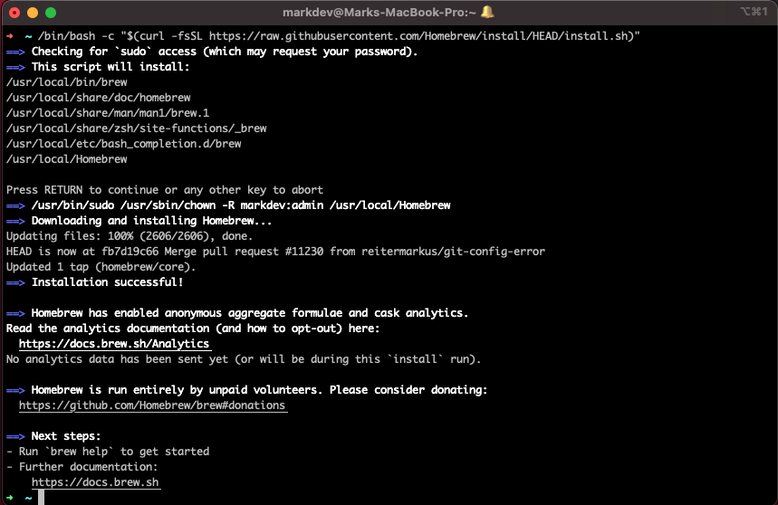

## **Install Python**
7. [Install Miniconda](https://docs.conda.io/en/latest/miniconda.html) (MacOSX 64-bit pkg version), which will include "only conda, Python, the packages they depend on, and a small number of other useful packages, including pip, zlib and a few others." Miniconda is a tool manage your Python environments and their respective packages.
   - There are alternatives to Miniconda, such as full Anaconda or downloading Python and managing your environment via venv or pyenv.
   - I believe Miniconda strikes a balance between being beginner friendly while also not being bloated with the extra software and packages found in full Anaconda.
   - If you have a preferred format, then please use that instead and account for it in the rest of this tutorial.

**Ensure that you download Miniconda into your `repos` directory!**
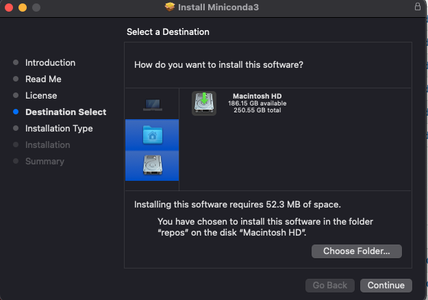


8. Use the following commands in terminal to activate your conda environment, save its path to your `.zshrc` file, and check if it activated properly:
```
> source ~/repos/miniconda3/bin/activate
> conda init zsh
> conda list
```

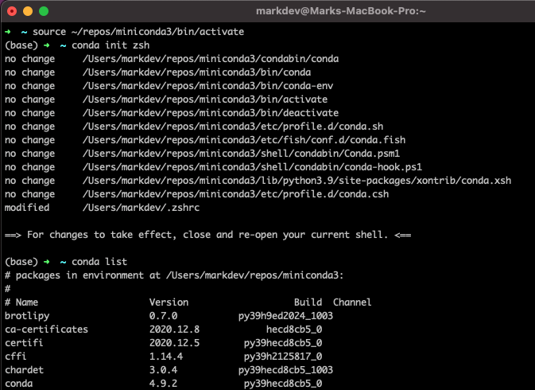

9. Check your `.zshrc` file to ensure your conda path was added correctly. You can find `.zshrc` in your home directory by revealing your hidden files by typing "command" + "shift" + "." simultaneously.

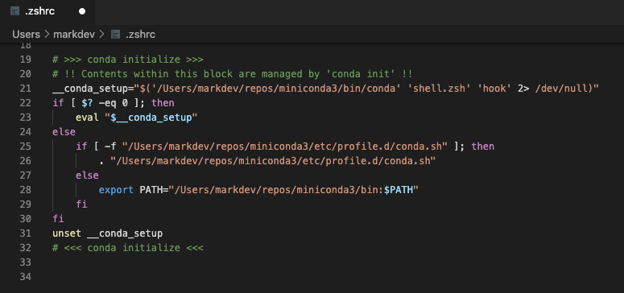

10. Restart your terminal to make sure your changes take place in your `.zshrc` file.

11. Add some data science packages to get you started:
```
> conda install numpy
> conda install pandas
> conda install scipy
> conda install matplotlib
> conda install seaborn
> conda install -c conda-forge scikit-learn
```
***Note: Since we are using Miniconda, we use `conda` instead of `pip` for most installations. I highly encourage you read this [blog post](https://www.anaconda.com/blog/understanding-conda-and-pip) to understand the difference.***

12. Install Jupyter Lab, which will allow you to create jupyter notebooks (i.e. `.ipynb`), which is great for experimenting and learning data science.
```
> conda install -c conda-forge jupyterlab
```
Run `jupyter lab` in terminal to see it in action!

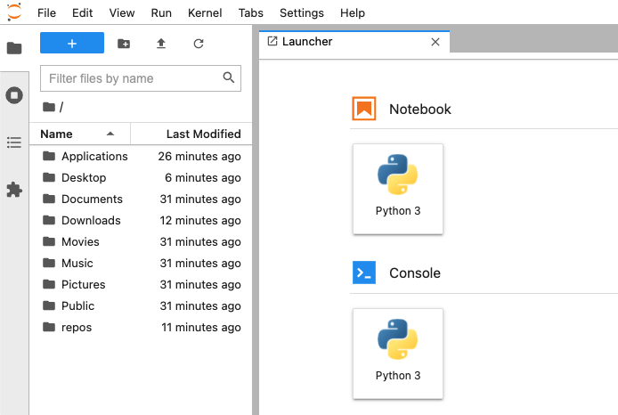

## **Install Your IDE**
13. [Install VSCode](https://code.visualstudio.com/download), an IDE to help you code in most languages (including Python). You are more than welcome to use your own preferred IDE, but note that this tutorial assumes VSCode moving forward.

14. [Install the Python extension](https://marketplace.visualstudio.com/items?itemName=ms-python.python) within VSCode.

15. Connect VSCode to your Miniconda python environment by going into your command pallet (i.e. typing "command" + "p" simultaneously) and type ">python: select interpreter" then select "~/repos/miniconda3/bin/python".

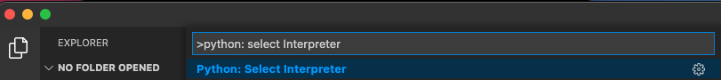
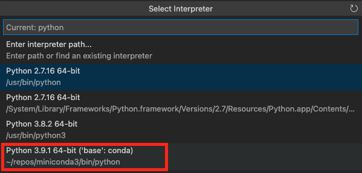

16. Check to make sure Miniconda connects with VSCode by doing the following:
    - Open new python file
    - Run `print(‘Hello World’)`
    - Accept and download any VSCode recommended packages to connect to conda

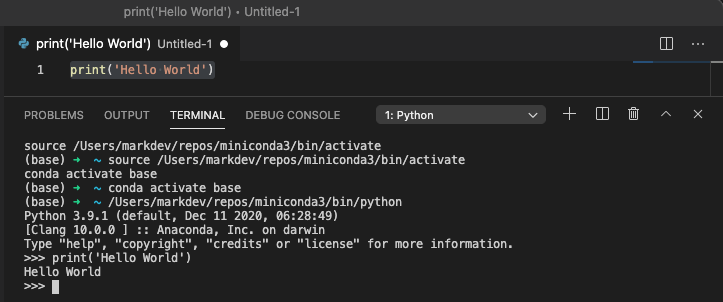

## **Set Up Git and GitHub**
17.  [Install Git](https://git-scm.com/downloads), a version control tool that you can use with websites such as GitHub, via conda.
```
> conda install git
```

18.  Go to GitHub (create an account if you don't have one already), and create a new repository called `setup-python-env`.
     - Description: "Python environment setup and customizations."
     - Set to private
     - Add README.md file that auto populates

19. In your local `repos` folder create another folder called `github` and clone your `setup-python-env` repository ([GitHub documentation](https://docs.github.com/en/github/creating-cloning-and-archiving-repositories/cloning-a-repository)) to the `github` folder with the following commands in terminal:
```
> cd ~/repos/github
> git clone https://github.com/<your_username>/setup-python-env.git
```

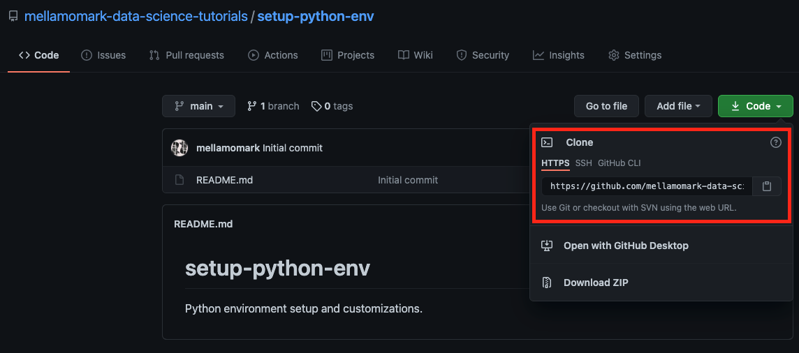
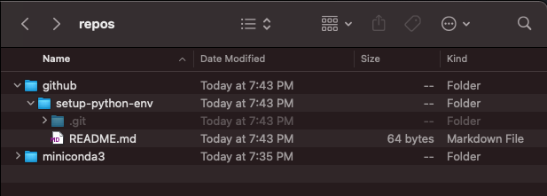

## **Optional: Customize Environment Appearance**
Though not needed, these steps will either add useful tools to help you write clear Python code or just add cosmetic touches to make it fun to use terminal!

20. Enable linting and auto-formatting tools to VSCode.
    - Install `mypy` and `black` via conda
    - VSCode > command pallet > ‘> python:select linter’ > select mypy
    - VSCode > preferences > settings
      - format on save (check)
      - python formatting provider (drop down menu: black)
    - settings > search “edit in json” > JSON > edit in settings.json
      - Add to JSON : "editor.rulers": [80]
```
> conda install mypy
> conda install black
```

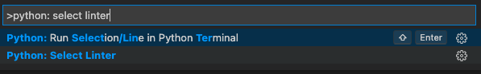
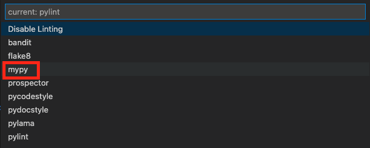
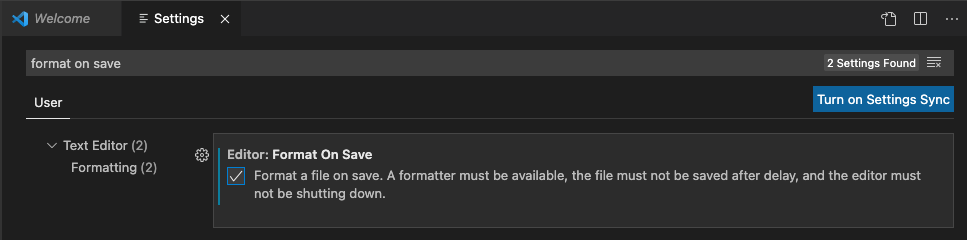
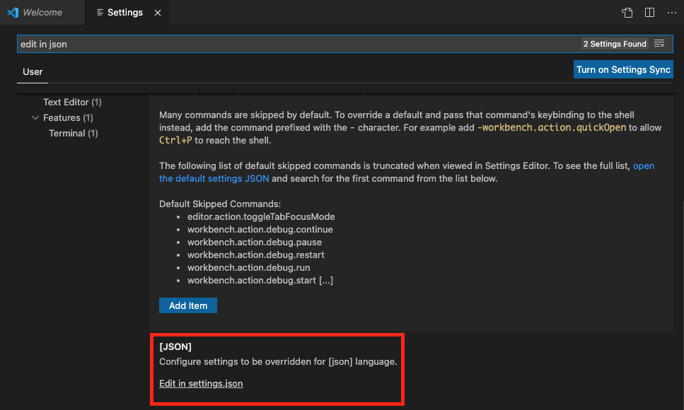

Your VSCode `settings.json` should look like the following (reference setting to copy and paste can be found in this repository under [reference-setting-files](https://github.com/mellamomark-data-science-tutorials/setup-python-env/tree/main/reference-setting-files):

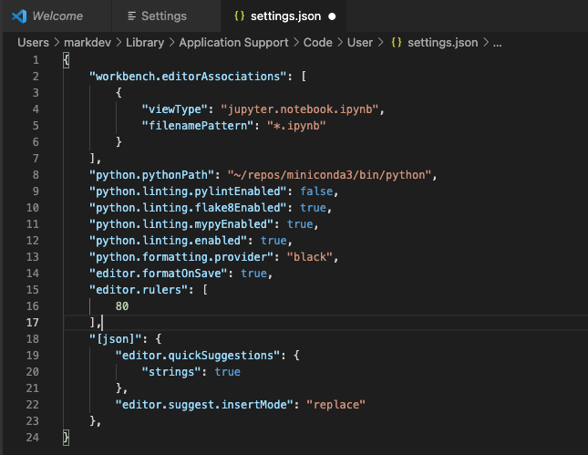

21. Customizing zsh and iTerm2
    - [Install powerlevel10k](https://github.com/romkatv/powerlevel10k) for zsh by cloning its GitHub repository and saving it your `.zshrc` file
    - Once installed, restart your terminal and powerlevel10k will automatically start a configuration wizard.
    - Follow all the powerlevel10k prompts in terminaland it will save all of your configuration in `.zshrc`
```
> git clone --depth=1 https://github.com/romkatv/powerlevel10k.git ~/powerlevel10k
> echo 'source ~/powerlevel10k/powerlevel10k.zsh-theme' >>~/.zshrc
```

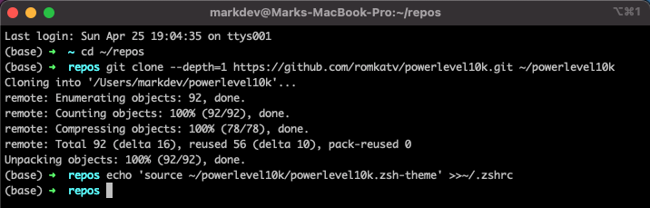

After the powerlevel10k setup, your terminal should look similar to this:
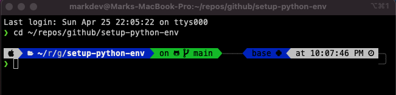

Your `.zshrc` should be updated as well and look like this:
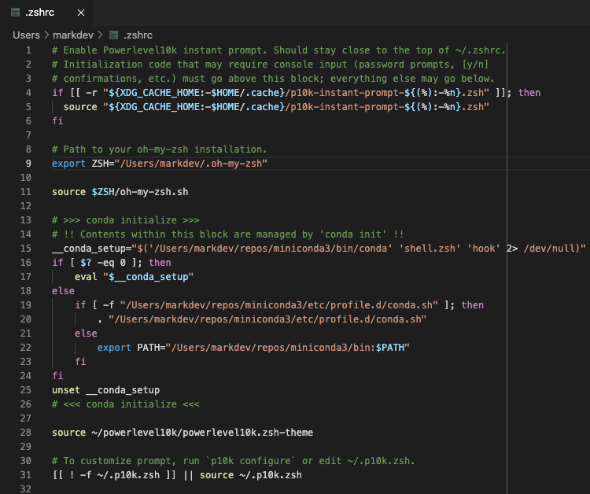

22. [Install zsh syntax highlighting](https://github.com/zsh-users/zsh-syntax-highlighting) to save you entering wrong commands.
    - Clone the zsh-syntax-highlighting GitHub repository into your `repos` directory.=
    - Add zsh-syntax-highlighting information to your `.zshrc` file
    - Note that zsh-syntax-highlighting information needs to be at the **end** of your `.zshrc` file
```
> cd ~/repos
> git clone https://github.com/zsh-users/zsh-syntax-highlighting.git
> echo "source ${(q-)PWD}/zsh-syntax-highlighting/zsh-syntax-highlighting.zsh" >> ${ZDOTDIR:-$HOME}/.zshrc
```

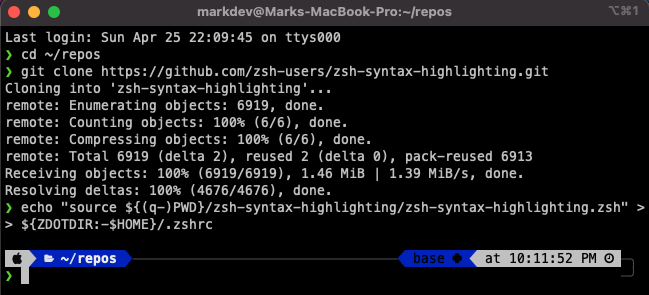
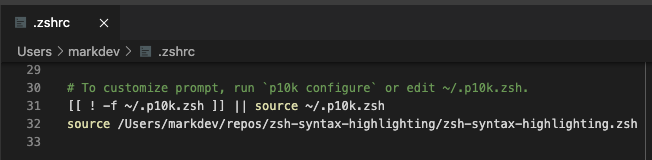

23. Customize iTerm2 (my favorite part), if you are new to using the command line I found this helped me get over the learning curve as I wanted to use it more!
    - Create a new iTerm2 profile
      - iTerm2 > preferences > profiles > text
      - Create new profile name “setup-python-env” and set it to default via other actions
    - Update iTerm2 font
      - iTerm2 > preferences > profiles > 
      - Go to Text and change Font to MesloLGS NF
      - Check “Use built-in Powerline glyphs”
    - Change your terminal's background image
      - Go find a cool image you like, for this tutorial I’m choosing a [copyright free image](https://unsplash.com/photos/Sc1GJCninik) (but my go to is the [Akira movie poster](https://images.fineartamerica.com/images/artworkimages/mediumlarge/3/1-akira-1988-movie-poster-cn-art.jpg))
      - iTerm2 > preferences > profiles > window
      - Select background image and set to enables and scale to fill
      - Lower blending to a level where the image is not distracting
    - Change text colors 
      - iTerm2 > preferences > profiles > colors
      - Change the colors to your liking and play around with your preferences
      - Pro tip: use this [image to hexcode tool](https://html-color-codes.info/colors-from-image/) to get colors to match your background image
    - For more fine-tune detail, such as the `>` color, go to the `.p10k.zsh` hidden file in your home directory for further customization
      - [Documentation for powerlevel10k customization](https://github.com/romkatv/powerlevel10k#batteries-included)
      - I recommend the following areas to start:
        - `typeset -g POWERLEVEL9K_LEFT_PROMPT_ELEMENTS`
        - `typeset -g POWERLEVEL9K_RIGHT_PROMPT_ELEMENTS`
        - `typeset -g POWERLEVEL9K_PROMPT_CHAR_OK`
        - `typeset -g POWERLEVEL9K_PROMPT_CHAR_ERROR`

Here is the copyright free image I used:


Here is what the terminal looks like afterwards:
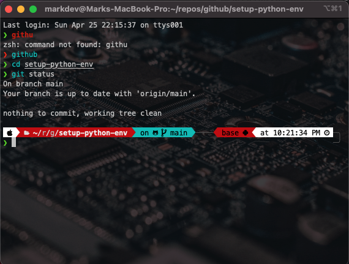

## **Saving Your Preferences to GitHub**
24. Create a new git branch to save your environment setup.
```
> cd ~/repos/github/setup-python-env
> git checkout -b ‘save_preferences’
```

25. `Copy and paste the following files into setup-python-env`:
    - powerlevel10k `.p10k.zsh` (home directory)
    - VSCode settings.json (`~/Library/Application Support/Code/User/settings.json`)
    - Oh My Zsh `.zshrc` (home directory)

26. Save iTerm2 profile as JSON into setup-python-env.
    - iTerm2 > preferences > profiles > other actions > save profile as json

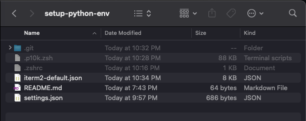

27. Add and commit file changes to local git branch and push to remote on Github.
```
> git status
> git add .
> git commit -m ‘saving environment preferences’
> git push --set-upstream origin save_preferences
```

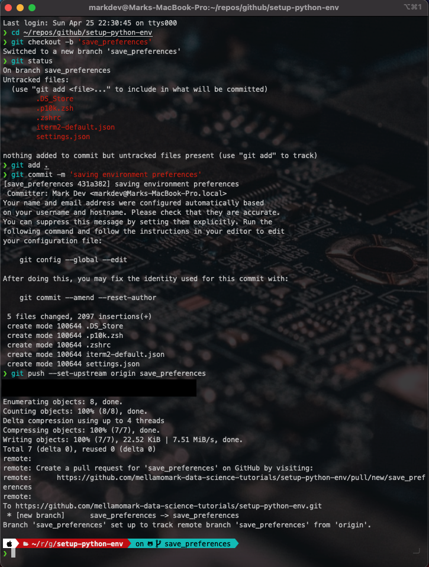

28. Follow the GitHub link provided in terminal to create a new pull request and merge it to your repository.

## **Congratulations!**
You have hopefully setup your Mac with a Python environment, installed an IDE to write code, customized your IDE and terminal to your liking, and saved all your preferences to your private GitHub repository.
